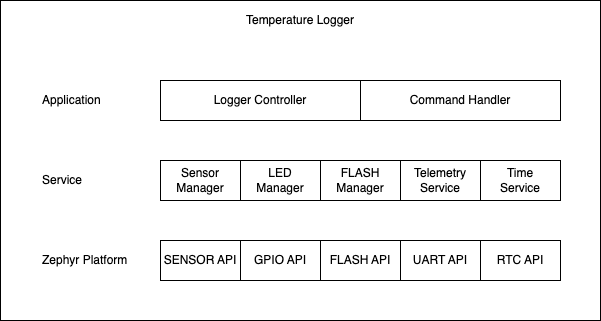

# Temperature Logger - Firmware project

## Hardware
* STM32F030C8T6 Microcontroller.
* GD25Q16CSJGR SPI FLASH.
* TMP1075DGK Temperature Sensor.

## Architecture


## Getting Started
Follow the official Zephyr guide [here](https://docs.zephyrproject.org/latest/develop/getting_started/index.html).

## Build the project
Once you have your toolchain setup. Activate your virtual enviroment:
```
source ~/zephyrproject/.venv/bin/activate
source ~/zephyrproject/zephyr/zephyr-env.sh
```

Build the project:
```
west build -b nucleo_f030r8 . -p
```

Flash the board:
```
west flash --runner jlink
```

## License
MIT

## Contact
Uriel Zazueta - uriel.zazueta@kawits.com