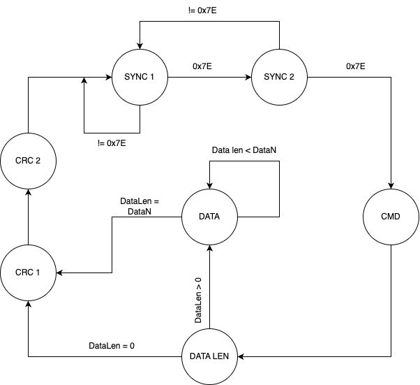

# Telemetry Frame Format

|       |        |     |             |      |      |      |
|-------|--------|-----|-------------|------|------|------|
|SYNC 1 | SYNC 2 | CMD | DATA LENGTH | DATA | CRC1 | CRC2 |
| 0x7E  | 0x7E   | 0xXX| 0xXX        | 0xXX | 0xXX | 0xXX |

Note: 
* 0x7E is the syncronization byte, it is a constant.
* 0xXX means that can take any value.

### Empty Telemetry Data Frame Example
|       |        |     |             |      |      |
|-------|--------|-----|-------------|------|------|
|SYNC 1 | SYNC 2 | CMD | DATA LENGTH | CRC1 | CRC2 |
| 0x7E  | 0x7E   | 0xXX| 0x00        | 0xXX | 0xXX |

### 2 Byte Payload Telemetry Data Frame Example
|       |        |     |             |            |      |      |
|-------|--------|-----|-------------|------------|------|------|
|SYNC 1 | SYNC 2 | CMD | DATA LENGTH | DATA       | CRC1 | CRC2 |
| 0x7E  | 0x7E   | 0xXX| 0x02        | 0xXX, 0xXX | 0xXX | 0xXX |

## Telemetry State Machine Frame Builder
